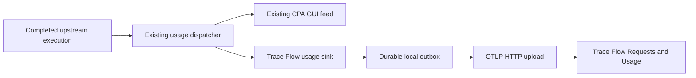

# Trace Flow exporter implementation plan

Status: implementation and acceptance checklist. Production remains disabled by default. See `trace-flow-exporter.md` for operator instructions and `trace-flow-exporter-acceptance.md` for verified evidence and remaining acceptance.

Implementation started from CLIProxyAPI commit `6bc7104b44f22bcbf81bd131dea035db2ede6074`. The authoritative Trace Flow guide and fixtures were refreshed to main at `815cab47dc414b6ca9afc2321f7a482119ab1d32`, including the deployed acknowledgement marker and account tuples.

## Outcome and boundary

Capture completed model executions routed through CLIProxyAPI and send metadata-only observations to Trace Flow. Trace Flow owns estimated API-equivalent pricing, account labels, Requests, and Usage. Proxy observations remain independently stored and reported from agent analytics.

Use a separate named usage plugin (`RegisterNamed`). Do not consume the management usage queue, change the GUI's queue retention, or route export traffic through the model proxy itself. This preserves independent delivery to CPA-Manager-Plus/EasyCLIProxyAPI and Trace Flow.

Initial scope includes models, canonical tokens, streaming, timing, failures, execution attempts, and upstream account coverage. Calls bypassing the proxy are outside coverage. Cross-source reconciliation, machine CPU/RAM, invoice/subscription spend, active quota polling, and a new dashboard are outside this implementation.

## Existing hooks and concrete gaps

| Area | Current code | Required change |
| --- | --- | --- |
| Completed attempts | `internal/runtime/executor/helps/usage_helpers.go`, `sdk/cliproxy/usage/manager.go` | Add the exporter to the existing fanout. Preserve every attempt's UUID, including additional-model records (`buildAdditionalModelRecord` assigns a new UUID). |
| Canonical tokens | `sdk/cliproxy/usage/accounting.go` | Reuse schema v2 and `Valid()`; preserve unclassified/inconsistent quality. |
| Missing usage | `EnsurePublished`, failure reporting, and usage parsers | Carry explicit usage-presence evidence before normalization. An empty detail currently becomes a valid zero breakdown (`NewUnclassifiedTokenBreakdown(0)`). |
| TTFT | `ttftDuration()` falls back to first-packet time | Carry token-TTFT presence separately from the first-packet fallback. |
| Account attribution | Reporter receives the selected `*auth.Auth` | Snapshot identity from that credential for that attempt. A later auth lookup can attribute old events to a replacement credential. |
| Provider family | `Record.Provider` is `executor.Identifier()`; for `OpenAICompatExecutor` it is the operator-configured provider key | Map the executor family to a fixed accepted value; never export the configured label. |
| Reported model/tier | `Record.ResponseModel`, `ResponseServiceTier` | Export only actual reported values. Audit supported provider parsers, especially Claude, which currently omits response-tier capture. |
| Shutdown | Usage manager drains asynchronously but `Stop()` does not join | Add a narrow drain-completion fence and wire exporter shutdown after producer shutdown and usage drain. |

Preserve the existing canonical thinking and translator architecture. Supporting capture code belongs in `internal/runtime/executor/helps/`. Do not add features under deprecated `/v0/management` endpoints.

## 1. Capture correctness

### Usage presence

Carry usage presence separately from numeric values through parsers, stream buffers, reporters, and the completed record. Presence is decided before `EnsureTokenBreakdownForProvider` normalization:

- Recognized count fields from the upstream, including explicit zeros, are present.
- Missing or empty usage without recognized count fields is missing.
- Partial usage on failures and stream cancellation is preserved as present.
- Direct SDK/plugin records gain an explicit presence field. An unflagged legacy record with any nonzero pre-normalization count is present. An unflagged all-zero record is missing. A known zero requires the explicit flag; never infer it from a normalized zero breakdown.

### Account identity

Capture account identity from the actual selected credential when the reporter is built, before asynchronous dispatch. It is an immutable typed observation, not a mutable auth pointer or an account lookup by index at upload time. Token refresh alone must not change the account reference.

| Coverage | Private HMAC input `id` | Evidence and limits |
| --- | --- | --- |
| `credential` | Canonical JSON array `["credential/1", family, provider_key, auth_id]` | `family` is the fixed exported provider value below. `provider_key` is the executor identifier, which for `OpenAICompatExecutor` is the configured compatibility key, so two compatible providers sharing an API key cannot collide. `auth_id` is `auth.ID`: the relative path for file credentials, or a `StableIDGenerator` content hash of key, base URL, proxy, prefix, and headers for config credentials. This is local credential identity, not verified provider identity. It splits after key rotation, file relocation, or proxy/prefix/header edits. Byte-identical config entries receive order-dependent `-N` suffixes, so reordering identical entries can swap their refs; they carry the same credential material, so this does not move usage between distinct credentials. |
| `provider-account` | Canonical JSON array, versioned per provider, defined with [TRA-307](https://linear.app/zaks-io/issue/TRA-307) and mirrored in the shared guide before use | Codex: workspace/account ID plus stable member ID, never workspace alone. Claude: organization UUID plus account UUID from OAuth metadata. Other providers only through an explicitly supported resolver with real evidence. |
| `unknown` | None | No usable identity; no account reference. |

TRA-307 now publishes the exact Codex and Claude tuples and shared JSON.stringify vectors. Provider-account coverage requires the documented credential evidence. Committed refs are never recomputed; later coverage upgrades start a new grouping.

Provider-account evidence comes only from identity stored with the credential by provider auth code: Claude OAuth metadata, and for Codex the `id_token` that the OAuth exchange or refresh writes into the credential (`codex_executor_auth.go`), read through `codex.ParseJWTToken`. That decode does not verify a signature. It is accepted as operator-trusted credential metadata, the same trust boundary as the refresh token stored beside it, and it is attribution metadata, not access-control evidence. A JWT from an inbound request, client header, plugin or SDK record field, or any value not stored with the credential never qualifies. Never promote an email, filename, label, or access-token fingerprint to provider-account identity.

The wire reference is lowercase hex HMAC-SHA256 of `coverage + "\0" + id` with a random per-installation secret, as the contract requires. Canonical JSON arrays make the tuple boundaries unambiguous. Raw identity inputs stay in process; outbox payloads contain only the reference and coverage. Existing GUI/plugin serialization must not gain those raw fields.

### Provider family

`gen_ai.system` is required and must match `^[a-z0-9][a-z0-9._-]{0,63}$`. It comes from a fixed table keyed by the concrete `Record.ExecutorType` plus the built-in executor's constant identifier:

- Built-in executors with constant identifiers map to that constant: `claude`, `codex` (both Codex executors), `gemini`, `gemini-interactions`, `vertex`, `aistudio`, `antigravity`, `kimi`, `xai`, `devin`, `meta`.
- `OpenAICompatExecutor` always maps to `openai-compatibility`, including behind the plugin-refresh wrapper, which delegates to the inner executor that builds the reporter. The configured provider key is never exported; it appears only inside the private credential HMAC input.
- Plugin RPC executors (`internal/pluginhost/adapters_executors.go`), handler-level plugin reporters built with an empty executor type (`sdk/api/handlers`), direct SDK records with empty or unrecognized `ExecutorType`, and any pair absent from the table have no family evidence. They are capture rejections with reason `provider_family_unknown`. Never sanitize a label or substitute a default family.

## 2. Exact wire contract

Implement the [merged imported-execution contract](https://github.com/zaks-io/trace-flow/blob/815cab47dc414b6ca9afc2321f7a482119ab1d32/docs/guides/imported-executions.md), not a generic automatic tracing pipeline.

- `POST /v1/traces`, authenticated with `X-Trace-Flow-Api-Key`. Collector credentials are a different intake path.
- Official generated [OTLP Go protobuf types](https://pkg.go.dev/go.opentelemetry.io/proto/otlp/collector/trace/v1), serialized as `application/x-protobuf`. Use the existing Go HTTP stack for transport. Do not use an SDK batch processor that owns different IDs, an in-memory retry queue, or incompatible timeouts.
- Scope `cliproxyapi.execution`, version `2`, no scope attributes. One root `SERVER` span per completed usage record, no parent/events/links/trace state/flags, empty status message. Status is `OK` or `ERROR` from the attempt outcome.
- Execution UUID is the stable source identity. It must be a canonical lowercase UUID with version 1-8 and RFC variant, not nil or max; otherwise the record is a capture rejection. Remove hyphens for the 32-hex trace ID; use its final 16 hex characters for the span ID. The short inbound `TraceID` is only optional `cliproxyapi.request.id` metadata and is never a dedupe or authoritative correlation key.
- Resource: stable installation UUID (generated v4) and `service.name=CLIProxyAPI`. If `service.version` is later added, capture and persist it with each event, never recalculate it during replay.
- Required span attributes: `cliproxyapi.execution.id`, `gen_ai.system`, `gen_ai.request.model`, `cliproxyapi.account.coverage`. Span name and `gen_ai.request.model` come from `Record.Model`; keep a differing client alias separately. `gen_ai.response.model` and response service tier come only from reported upstream values. Missing reported model/tier remains unpriced under the current pricing contract.
- At most 32 span attributes. The full span allowlist is 27 keys, so the mapper asserts the cap rather than truncating.
- Start is `RequestedAt`; end is `RequestedAt + Latency`, both captured by the reporter, never upload time. `gen_ai.server.time_to_first_token` is emitted only when token-TTFT presence is set, as whole milliseconds truncated toward zero, and only when the untruncated TTFT does not exceed the captured duration. Otherwise it is omitted with a coverage diagnostic. A first-packet or keepalive measurement is never labelled token TTFT.
- Emit either all nine canonical token counts, version and quality, or only `gen_ai.usage.missing=true`. Validate sums, nonnegativity, the receiver's UInt32 total limit, positive Int64 nanosecond timestamps, end not before start, and maximum 24-hour duration.
- Export a whitelist of accepted fields only. No cost attributes, server source/import stamps, provider URLs, configured provider labels, raw keys/account IDs, OAuth material or token fingerprints, binding fingerprints, arbitrary headers, failure bodies, prompts, responses, filenames, or email labels.
- Optional values (alias, session IDs, request ID, tiers) are validated against the receiver patterns before inclusion. A rejected optional value is omitted with a coverage diagnostic.
- Required-field or accounting failures are capture rejections: counted with a sanitized reason, never persisted as payload, never uploaded. Never replace missing required values with plausible defaults.

Cache writes lacking TTL may remain partly unpriced under Trace Flow's current contract. Preserve the fact and coverage. Do not guess a TTL or add currently unsupported attributes to make an estimate look complete.

## 3. Durable outbox and uploader

Use [bbolt](https://github.com/etcd-io/bbolt), a pure-Go transactional file store, rather than a custom journal. Keep concrete storage and HTTP types; use `httptest` and temporary databases for substitution tests instead of speculative adapter interfaces.

Suggested package: `internal/traceflow/` with small domain files for account hashing, span mapping, outbox, uploader, binding, maintenance, exporter lifecycle, and status. Add configuration in `internal/config` and ownership in `sdk/cliproxy/service_lifecycle.go` / `service_config.go`.

### Persistence and availability

- Installation UUID and HMAC secret live in private local state outside `auths/` and auth backup/sync stores. Directory mode 0700, database mode 0600, one writer per path (bbolt file lock). Missing state for an existing backlog is a hard error, never silently a new identity.
- The sink builds a sanitized immutable event and enqueues it in a bounded local buffer. A writer group-commits with fsync enabled, initially every 100 ms or 256 events. Suggested ingress capacity: 1,024 events. These are explicit tuning defaults, not accounting assumptions.
- Each committed record stores source content (complete span/resource bytes, execution UUID, schema version, payload digest over source content only) and separate delivery metadata (sequence, state, reason code, binding ID). Delivery metadata can change through the uploader and maintenance commands; source content and digest never change.
- States: `pending`, `quarantined` (with reason), and deleted on acknowledgement. Destination pause is a persisted per-binding flag with reason, separate from record state.

### Deletion, dedupe horizon, and storage budget

- An acknowledgement deletes the payload in the same transaction that writes a tombstone `{execution UUID, digest, acked_at}`. Tombstones are pruned past 7 days or 250,000 entries, whichever comes first, at startup and hourly by the writer.
- Local dedupe covers pending and quarantined records plus tombstones. Within that horizon, a repeated UUID with an identical digest is dropped as idempotent; a different digest is a local conflict: the original record or tombstone is untouched and the conflicting observation is counted with a digest-only diagnostic, never stored. Beyond the horizon, Trace Flow's server-side ledger handles exact retries and repair records.
- Payload budget: 256 MiB of pending plus quarantined payload bytes, configurable. Free-space reserve: 1 GiB on the outbox filesystem, configurable. A commit that would exceed the budget or breach the reserve is refused and counted as capacity loss; already committed events are preserved. With delete-on-ack, bbolt reuses freed pages, so the file high-water mark is bounded by peak payload plus tombstones.
- Startup compaction runs before the writer opens when free-page bytes are at least 64 MiB and at least half the file, and filesystem free space is at least live bytes plus the reserve. It uses `bbolt.Compact` into `<outbox>.compact.tmp` in the same directory, fsyncs it, atomically renames it over the original, and fsyncs the directory. A crash before rename leaves the original intact and the temp file is deleted at next startup; a crash after rename leaves a complete compacted file. Insufficient headroom skips compaction and reports it. Exporter open, including compaction and sink registration, completes before the API server starts listening, so no early execution reaches the dispatcher without the sink. Measure compaction time and footprint before setting operational capacity expectations.
- Never evict old undelivered records silently. Capacity, buffer overflow, capture rejection, or disk failure produces explicit counters and an unhealthy exporter state. Keep model serving and the GUI feed running; do not accumulate an unbounded exporter buffer.
- Once committed, an event survives restart and acknowledgement ambiguity. Before commit, it is still vulnerable to process loss: the existing shared RAM queue plus the bounded group-commit buffer. This is durable delivery after capture, not a guarantee that every completed request survives SIGKILL. Eliminating that window would require synchronous persistence in the execution path and a separate latency tradeoff.

### Destination binding

- Binding ID: lowercase hex HMAC-SHA256 under a binding key derived as HMAC-SHA256(installation secret, `"cliproxyapi.traceflow.binding-key/1"`), over the length-prefixed tuple (`"binding/1"`, normalized endpoint, API key value). Each field is a 4-byte big-endian length followed by its bytes. The normalized endpoint has lowercase scheme and host, default port elided, exact path, and no userinfo, query, or fragment (config validation rejects those). The account-ref HMAC uses the raw secret with the contract's input format, so the two uses are domain-separated.
- The binding ID is private local metadata stored with each committed record and in status output. It is never exported, logged with the key, or placed in config snapshots or Home dispatch.
- At startup the exporter computes the current binding from config and the environment. Records whose binding differs are held with destination pause `binding_mismatch`; status shows the old and new binding IDs and the affected count and bytes. New captures commit and upload under the current binding. This detects key rotation under the same environment variable name.
- Trace Flow exposes no key-to-Organization lookup, so CLIProxyAPI cannot verify that two bindings share an Organization. Rebind is an explicit offline operator attestation (see Maintenance). It rewrites only the binding ID of the selected records, never source content or digest, and writes an audit entry with old binding, new binding, record count, and time. Without rebind, the held records stay paused or are discarded explicitly; they are never replayed through another binding automatically.

### Upload and acknowledgement

One independent uploader reads short database snapshots of pending records for the current, unpaused binding, releases transactions before networking, and sends bounded batches, initially up to 256 spans and 1 MiB uncompressed. The receiver currently caps requests at 10 MiB. Requests are sequential. Disable HTTP redirects so the intake credential cannot follow an unexpected redirect. Enforce TLS for remote endpoints; local HTTP is for local verification.

**Acknowledgement marker (TRA-312, deployed in cloud-dev).** The shared contract now requires `X-Trace-Flow-Contract: cliproxyapi.execution/2`, emitted only after the imported path validates and durably persists the batch. The exporter enforces it on every upload. There is no bypass setting.

Local payload deletion requires all of: HTTP 200, the exact marker, `X-Trace-Flow-Recording: true`, and a body that decodes as an `ExportTraceServiceResponse` with absent or zero `rejectedSpans` and no `errorMessage`. The receiver currently returns JSON even for protobuf uploads. Classify an HTTP 200 in this order: recording false, then any other `partialSuccess`, then the marker check. The marker is sent only after persistence, so a recording-disabled response never carries it.

| Result | Behavior |
| --- | --- |
| All acknowledgement conditions met | Transactionally delete payloads and write tombstones. |
| HTTP 200 without the marker (including an older or generic receiver) | Fail closed: retain records as pending, pause the binding with `ack_marker_missing`. Data a generic receiver may already have stored cannot be recalled; nothing is deleted locally. |
| HTTP 200, `X-Trace-Flow-Recording: false`, `rejectedSpans` equal to batch size | Known whole rejection; nothing was stored. Records stay pending; pause the binding with `recording_disabled`. Resume only through the explicit resume command after correcting the policy. |
| Any other `partialSuccess` (rejections without recording false, rejections fewer than the batch, or an `errorMessage`) | Ambiguous. Quarantine the batch with `partial_success_ambiguous` and pause the binding. Never retry automatically; reconcile and requeue explicitly. |
| HTTP 429, 503, other retryable 5xx, connection failure, lost response | Retry identical records with exponential backoff and jitter; respect `Retry-After`. The receiver persists to R2 before returning 200, so replay after a lost acknowledgement is safe. |
| HTTP 400 with a recognized span-scoped imported rule code | Bounded split (below). |
| HTTP 400 with a request-wide or unrecognized code (`request_shape`, `resource_*`, `scope_*`, `execution_missing`, `mixed_scopes`, `reserved_attribute`, `unsupported_version`, generic free-text validation messages, decode failures) | Systematic. Quarantine the batch with the rule code, pause the binding, no splitting. |
| HTTP 413 | Split batches; quarantine a single oversized event as `oversize`. |
| HTTP 401/403, 415, malformed acknowledgement | Retain records as pending, pause the binding with the reason, report the actionable error. |

**Bounded 400 split.** The receiver validates the whole request before persisting and returns only the first failing rule code, not the span index (`index.ts`, `imported/validate.ts`). Splitting applies only when the code is one of the span-scoped validator codes (`span_shape`, `status`, `timing`, `attribute_*`, `account_coverage`, `account_ref`, `required_attribute`, `otel_identity`, `span_name`, `usage_*`, `ttft_range`, `http_status_range`, `duplicate_execution`). The `attribute_*` codes can also come from the shared resource; that case fails every half and stops at the second-offender rule. The uploader bisects sequentially: halves that are acknowledged are deleted normally, and the failing half is split again. Limits: at most 16 split requests plus the initial request per original batch, enough to isolate one offender among 256. The isolated event is quarantined with the rule code. If a second offender appears, a half fails with a request-wide code, or the limit is reached, the remaining records are quarantined, the binding is paused, and splitting stops. Because local validation mirrors the receiver, any 400 also raises a contract-drift diagnostic.

No post-connect network deadlines are introduced. The uploader has no `http.Client.Timeout` or response-body/header deadline under the current repository rule. A stalled connection can stall delivery, but not capture or model responses; backlog/last-ack status makes that visible. Lifecycle cancellation closes an in-flight upload on shutdown. A network timeout exception would be a separate repository-policy change, not a hidden exporter setting.

### Maintenance commands

Maintenance uses the existing server flag parser in `cmd/server/main.go` as one-shot command-mode flags, alongside `-vertex-import` and the login flags, implemented in `internal/cmd`. Each command loads `-config`, opens the outbox as its single writer, prints sanitized output, and exits. It fails if a running server holds the outbox lock. No HTTP or management endpoint is added.

| Flag | Effect |
| --- | --- |
| `-trace-flow-status` | Counts and bytes by state, reason, and binding; current and held binding IDs; pause reasons; oldest pending age; last durable commit; last acknowledgement; retry state; tombstone count; compaction result; capture-rejection, local-conflict, capacity-loss, and discard counters. |
| `-trace-flow-resume` | Clears persisted pause reasons for the current binding (`recording_disabled`, `ack_marker_missing`, auth/encoding/ack failures, systematic 400). Pending records upload on next start. |
| `-trace-flow-requeue <selector>` | Moves selected quarantined records back to pending with unchanged content and digest. |
| `-trace-flow-rebind <old-binding-id> -trace-flow-rebind-to <new-binding-id>` | Requires both IDs. Verifies the new ID equals the binding computed from current config and environment, and the old ID holds records. Prints that Organization identity cannot be verified and that the operator attests both bindings belong to the same Organization. Rewrites only the binding ID and writes the audit entry. |
| `-trace-flow-discard <selector> -trace-flow-confirm-discard` | Deletes selected pending or quarantined payloads, keeps tombstones, and increments the discard counter. |

Selectors are explicit: `execution:<uuid>`, `reason:<rule-code>`, or `binding:<id>`. There is no implicit "all". Nothing is requeued implicitly, including after a binary or contract-version change. Local conflicts are counters, not stored payloads, so they are never requeued and never rewrite the original UUID or source data.

### Ownership, config, and shutdown

- Export is disabled by default. Enabled configuration requires an explicit endpoint, local outbox location, and an environment variable name for the intake API key. Missing secret or invalid state fails startup loudly. Environment values are read at startup only; key rotation takes effect at restart through the binding check. Do not put the secret value in configuration JSON, config snapshots, Home dispatch, logs, or the outbox.
- Runtime owns one named sink and one uploader; repeated config updates cannot register duplicate sinks or start duplicate workers. Export enablement is independent of the existing GUI usage-queue toggle.
- Hot reload may pause or unpause an exporter that started enabled. Enabling an exporter that started disabled requires restart, because its state and secret are validated only at startup. A reload that changes endpoint, API-key variable name, or outbox location, or that is invalid, is rejected with a logged error and the last valid running state continues; such changes take effect at restart.
- Disabling pauses capture/upload and preserves committed backlog and identity. Changing installation identity or outbox location requires restart and explicit migration; do not silently create a new installation for old events.
- Follow existing request/executor shutdown, then wait for shared usage dispatch to drain, flush the writer, cancel networking with pending events retained, and close the store. Test late producers and shutdown-deadline exhaustion; closing the HTTP listener alone is not evidence that every usage producer has stopped.
- At runtime, report the same fields as `-trace-flow-status` and exporter health through structured logs. Do not add a second account dashboard or modify deprecated management endpoints.

## Delivery slices and dependencies

| Slice | Main work | Verifiable exit |
| --- | --- | --- |
| 1. Capture correctness | Usage presence, account snapshots, provider-family table, response model/tier audit, TTFT presence, drain fence. | Missing/zero/legacy/failure cases differ correctly; compatible providers sharing a key produce distinct credential refs; unknown families are rejected and counted; refresh preserves identity; legacy GUI/plugin payloads have no leaks or regressions. |
| 2. Contract mapping | Installation state, HMAC and binding conventions, official OTLP types, strict pure mapping/validation. | Semantic parity with Trace Flow's v2 fixture and validator; deterministic IDs and payloads; attribute cap, UUID, and TTFT truncation cases; whitelist/secret fixtures pass. |
| 3. Durable delivery | bbolt, bounded capture, uploader, acknowledgement classification, binding, maintenance commands, compaction, config/lifecycle/status. | Subprocess crash/restart and lost-ack tests preserve committed content; marker-absent and recording-false never delete; 400 split stays within limits; rotation is detected and rebind is audited; overload is visible; GUI fanout remains intact during outages. |
| 4. Cloud-dev acceptance | Real binary, real Claude/Codex calls, query/browser readback, account isolation, replay/recovery and separate-source proof. | Reconcile recorded executions/tokens/estimates with Requests and Usage using the actual exporter. |

Slices 1-3 can proceed before Trace Flow production rollout, using local synthetic traffic and a fake receiver that emits the required marker, then the local Trace Flow receiver once it emits the marker. Share sanitized generated fixtures with Trace Flow.

Cross-repo status:

- TRA-300/301/302/307/312 are complete; the guide publishes the acknowledgement and identity conventions.
- Actual exporter cloud-dev acceptance completes the exporter side of TRA-305. OAuth member/refresh and cross-Organization proof still require suitable credentials.

[TRA-309](https://linear.app/zaks-io/issue/TRA-309) proposes passive quota/rate-limit fields. It is a future contract extension: send no new quota attributes until an explicit allowlist is accepted and deployed. Account nicknames belong to Trace Flow, and success rate can derive from existing execution outcomes.

## Done

- [x] Focused usage/account/mapping/outbox/uploader/lifecycle tests pass, including reported zero versus missing usage, unflagged legacy nonzero versus all-zero records, partial failed-stream usage, stable refresh identity, and the provider-family table (including `OpenAICompatExecutor` and SDK records without family evidence).
- [x] Invalid or absent required data never becomes a fabricated model, timestamp, account, provider family, zero usage, response tier, TTFT, cache TTL, or price. Capture rejections are counted and never uploaded.
- [x] Mapping tests prove at most 32 span attributes, rejection of non-canonical or wrong-version UUIDs, and TTFT truncation that never exceeds the captured duration.
- [x] Restart after local commit resends identical content. A server-accepted batch with a lost acknowledgement counts once after replay. Distinct attempts and additional-model records remain distinct. A conflicting repeated UUID leaves the original untouched.
- [x] A response without the exact marker, a recording-disabled HTTP 200, any ambiguous partial success, an invalid API key, and a malformed response each leave payloads in place, pause the binding, and show the reason in status. None retries automatically except the retryable classes.
- [x] A single invalid span in a 256-span batch is isolated in at most 17 total requests while the other spans are acknowledged. A request-wide 400 or a second offender pauses without further requests.
- [x] Changing the API key value under the same variable name is detected at restart; held records do not upload until an audited rebind or explicit discard; rebind leaves source content and digests unchanged. An invalid or restart-only reload keeps the last valid running state.
- [x] Status, resume, requeue, rebind, and selected discard work offline through the server flags, refuse to run against a locked outbox, and update visible counters.
- [ ] Full outbox, free-space reserve breach, disk errors, tombstone pruning, crash during startup compaction, and shutdown interruption have verified and visible behavior; storage stays within budget plus tombstones under a sustained-outage test.
- [ ] Exporter outage does not block model serving; existing GUI observers receive the same executions. Measure capture overhead and resource growth under representative concurrency.
- [ ] Real streamed Claude and Codex calls reach cloud-dev with independently checked tokens, failures, timing, account coverage, and cost status. Reported model/tier gaps remain unpriced; real estimates are verified where the upstream reports enough evidence.
- [ ] Two accounts, and two members of one Codex workspace, produce distinct refs with `cliproxyapi.account.coverage=provider-account` (credential-coverage separation alone does not satisfy this). Token refresh preserves grouping. Credential deletion/replacement cannot change old observations. Cross-installation and cross-Organization isolation is verified.
- [ ] Proxy and Collector Agent observations remain independently stored and totaled. Replaying one source does not change the other.
- [ ] Required `gofmt`, compile verification, relevant tests/race checks, full `go test ./...`, and repository CI pass for implementation PRs. Public-contract/account/queue changes require a hosted result on the exact merge head. Run cross-review immediately while hosted review proceeds and fix findings. Serious throttling triggers local cross-review and continued work, not a waived merge gate; if no hosted result is possible within about two hours, ask Isaac.
- [ ] TRA-305 records real cloud-dev acceptance with the actual exporter and the deployed acknowledgement marker. Fixture-only success does not complete acceptance.
- [x] Production enablement is a separate final step after successful dev acceptance and Isaac's explicit approval. Keep the exporter disabled in production until then.

Unchecked items require explicit acceptance evidence; they are not claims of completion. Production enablement remains separate.
